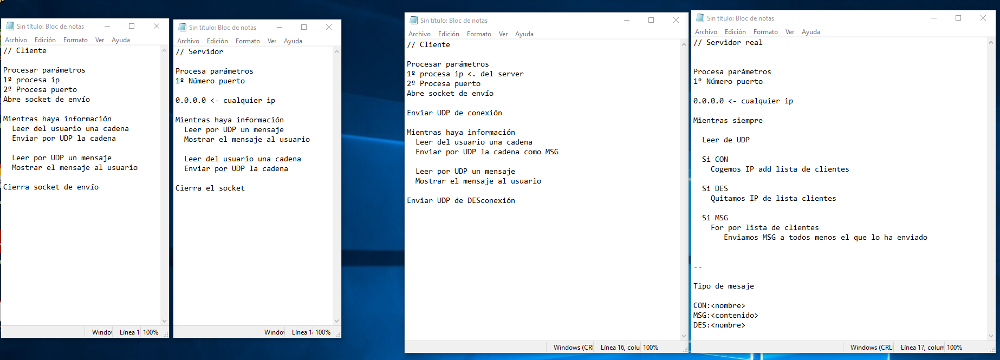

# Comunicaciones

## TCP y UDP

[Teoría y ejemplos](https://psp2dam.github.io/psp_pages/es/unit4/)

## A mano

Prácticas con netcat y Wireshark

- Comunicación TCP
- Comunicación UDP
- Comunicación Broadcast

## Ejemplos

Ver código del repositorio del [módulo](https://github.com/JorgeDuenasLerin/programacion-de-servicios-y-procesos/tree/main/ut03).

[Otros ejemplos](https://chuidiang.org/index.php?title=Categor%C3%ADa:Sockets)

## UDP

Tarea 1: Ejemplo simple

- Crea un programa servidor que reciba por parámetro un número que representa el puerto en el que escuchará, cuando reciba un mensaje lo escribirá por pantalla.
- Crea un programa cliente que reciba por parámetro una cadena representando la dirección ip, un número representando el puerto y una última cadena representando el texto a enviar. El programa enviará la información usando UDP.

Tarea 2: Eco

- Crea un programa con parámetros similares al anterior.
- Esta vez el servidor se ejecutará con un bucle while true. Será un servicio de eco, envía al cliente la información que se le ha mandado.
- El cliente envía información, y espera una respuesta en el mismo puerto.

Tarea 3: Servicio StringReverse

- Implementa un servicio que devuelva la cadena recibida pero dada la vuelta

Tarea 4: Chat UDP (envío-recepción alternativo)

- Implementa un chat cliente-servidor, estos programas serán monothread.
- Para facilitar la tarea primero envía el cliente, y espera respuesta.
- Para facilitar la tarea primero espera respuesta el servidor, y luego envía respuesta.
- Tanto el cliente como el servidor reciben como parámetro el puerto. El cliente también recibirá como parámetro la dirección ip.
- Ambos programas muestran un prompt al usuario para pedir y mostrar los mensajes enviados.

Tarea 5: Chat UDP (Multithread. Que molesta e interrumpe)

Implementa el chat UDP con la posibilidad de recepción multiple (Utiliza threads)

Tarea 6: Chat UDP (Multithread.)

Si el usuario está escribiendo guarda los mensajes hasta que borre lo que está escribiendo o pulse enter.

Tarea 7: Ascensores

Estás desarrollando el software de control de unos ascensores para la conserjería. Los ascensores emiten cada 100 milisegundos una trama de control con el siguiente formato:

```
COD_ASCENSOR;PISO;DIRECCIÓN
```

Código de ascensor es un valor numérico 01,02,03,etc.
Piso es una cadena: -1,-2, PB, 01, 02, etc.
Dirección puede ser U o D, Up or Down, es solo un carácter.

Tienes que hacer un programa simulador que recibe por parámetro el número de ascensor que representa el simulador y la dirección ip del software de control. Este simulador permite al usuario moverse entre plantas. El ascensor tarda 1 segundo en moverse entre plantas.

Debes programar un programa con interfaz gráfico para visualizar el estado de los ascensores, mostrar el número de ascensor, el piso donde está y si va hacía arriba. Este no deberá ser multithread, puede diferenciar en la trama de que ascensor se trata. Deberá mostrar en el interfaz gráfico el estado de 4 ascensores.

### Mini Proyecto

Chat cliente servidor UDP. Ver archivo con esquema:



## UDP Broadcast

Broadcast es una comunicación a todos los equipos de la misma red. Para realizar el envío se debe utilizar la dirección de broadcast (Con todos los bits de la dirección de red a 1). En java hay que especificar que el envío será broadcast (En anteriores prácticas funciona sin ese flag)

```java
DatagramSocket ds =  new DatagramSocket();
byte buffer[] = "Hola mundo\n".getBytes();
//String ip = "192.168.20.200";
String ip = "192.168.20.255";
ds.setBroadcast(true);
DatagramPacket p = new DatagramPacket(
        buffer,
        buffer.length,
        InetAddress.getByName(ip),
        4321
    );

ds.send(p);
ds.close();
```

Realiza esta práctica con al menos 3 compañeros:

- Elige una dirección en el rango ```172.20.0.0/16````. Configura cada equipo en ese rango
- Comprueba la comunicación haciendo ```ping```
- Ahora genera un código de servidor que escriba por pantalla el mensaje que recibe, la dirección ip y el puerto.
- Después escribe un cliente que haga envíos por broadcast.

Ejemplo de ejecución del server:

```
java server 8765
172.20.0.1:56444 Hola gente!
172.20.0.2:36544 Cómo estáis?
```

Ejemplo de ejecución de cliente

```
java cliente ""
```

## UDP Multicast


## TCP

Pronto nuevos protocolos....


## Ideas Futuras

Comunicación multicast.
Juego de adivina el número.
Juego del ahorcado.
Implementa un servidor de reproducción de MP3 (con TCP). Versión listado de canciones en el server.
Implementa un servidor de reproducción de MP3 (con TCP). Versión envío de canción por red.

